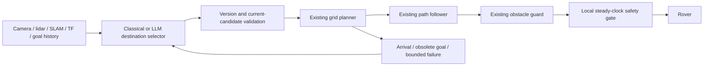

# Hierarchical exploration implementation

The new selector chooses an **approach destination**, not drive/turn commands.
`ExplorationPolicy` calls a common selector after its existing reachable-candidate
and memory filtering. `ClassicalSelector` wraps the original weighted selector;
`GoalExecutive` obtains an external choice and revalidates it against the current
online grid. The original direct-control Luna mode remains separately available.
No Nav2, navigation fallback, new model, API migration, or model experiment was used.



The conservative asynchronous policy stops while a necessary selection is pending.
It does not make speculative requests during valid route tracking. Ordinary
replans and bounded local recovery stay local. One transport worker, generation
invalidation, current-world-point validation, debounced obsolescence and latched
termination prevent delayed decisions from restarting canceled motion.

## Current physical route verification: passed (mock only)

One new attempt succeeded; the second authorized attempt was not used. No LLM
calls or paid experiments occurred. Command executed once:
```bash
./scripts/run_hierarchical_pilot --hierarchical-selector mock --wall-budget 120 --stop-after-arrival --output experiment_runs/hierarchical-route-a1-20260909
```

- Four exact onboard observations/candidate sets and four mock responses; two
  accepted destinations. A1 became obsolete as the map evolved; one stale
  response was rejected. A fresh decision used the updated map.
- A3 selected/accepted at map **(2.912442, -0.201428) m**; recorded route endpoint
  matches. Arrival distance **0.227116 m**, inside native **0.25 m** criterion.
- **275 controller updates** (268 nonzero) from A3 acceptance to arrival with
  **zero intervening selector requests**. Total physical path **3.9551 m**.
- **57.803 wall /41.260 simulation seconds**; mock selector-wait state **2.8227
  wall seconds**, not model latency. A post-arrival request was canceled before
  acceptance; no delayed destination restarted motion.
- Final cmd_vel **[0,0]**; no nonzero commands >.15 sim seconds after cancellation.
  All six owned process groups exited 0; independent host check confirms cleanup.

**Mock integration evidence, not LLM performance or full exploration completion.**
Stopped after arrival; original full-mission evaluator does not pass. Known grid
77.5661%, five remaining frontier components; not accessible-area coverage. No
contact sensor/collision-free claim. Safety holds were startup camera/map
availability and resume debounce; meaningful thresholds were retained.

Evidence: `experiment_runs/hierarchical-route-a1-20260909/operational_evidence.json`,
`route-trajectory.png`, and `classical/{bag/,executive.jsonl,goal_observations.jsonl,
cleanup.json,bag_verification.json}`. The `classical/` name is the reused runner's
shared-controller slot; manifest explicitly labels selector mock / diagnostic true.
Arrival distance uses recorded map-stamped TF, matching the native criterion;
the separately logged 0.5-second pose-timer sample is older.

14 focused checks passed before live build/run; three budget/launch checks passed
afterward. The motion/selector code was not modified after success. Later changes
concern reporting and future pair-launch/outcome handling; final source diffs
separate these from live-verified code.

## Preserved earlier diagnostic

`experiment_runs/hierarchical-mock-20260909/` is unchanged. Its stationary run
exposed inappropriate absolute EKF covariance gating and a shutdown-context error.
The corrected velocity-covariance/TF gate and shutdown guard were live-verified by
the new attempt. No safety threshold was loosened during the new run. Absolute
odometry covariance is not SLAM uncertainty; EKF fuses velocity/yaw rate only.

## Future comparison under contract v2 (not launched)

```bash
./scripts/run_hierarchical_comparison --enable-model --output experiment_runs/hierarchical-luna-pair-01
```
Hierarchical classical versus hierarchical gpt-5.6-luna / low; identical local
motion stacks and original evaluator, same world/spawn, fresh simulation/SLAM
per method, 600 wall seconds each. At most 20 externally submitted LLM decision
turns, enforced at turn/start submission. No application-level retries or model
substitutions. The previous inference-count requirement was explicitly revised
by the user; archived contract: HIERARCHICAL_BENCHMARK_CONTRACT_v1.md.
Internal requests may exceed submitted turns. This is not a guaranteed token or
monetary cap. Preserve exposed tokens, retry/compaction events and response IDs.
Model execution remains disabled by default. This task authorizes mock diagnostics
only, so --enable-model is never used now. The old inference_cap_unavailable
interlock is removed, not relabeled as internal-inference enforcement.

Persistent app-server transport/model behavior remains untested live. Physical route integration now passes the mock diagnostic above; no model
comparison has been launched. Existing failed diagnostic artifacts above
are preserved. The mock deterministically chooses the nearest supplied approach
ID using estimated map pose (ID breaks ties); normal validation/planning/safety
remain mandatory. No model-performance claim follows from mock integration.

Prediction: fewer externally submitted model decisions and less model-waiting
time while retaining original exploration completion. Smoother motion alone is
not success. Original coverage terminology and contact-sensor limitations remain.
