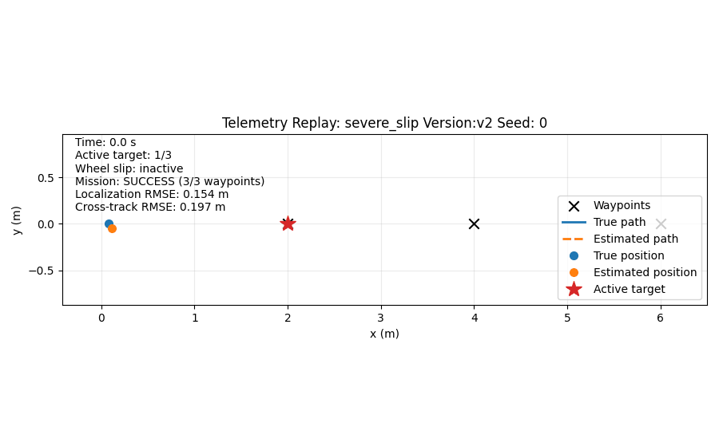

# Robot Mission Reliability Benchmark

[](https://github.com/KrisDownes/physical-ai-systems/actions/workflows/robot-reliability-tests.yml)

It tests how two localization approaches affect the mission performance of a simulated differential-drive robot under GPS noise and left-wheel slip.

It is not a production robotics system or a physical-robot demonstration.



The replay shows the true path, estimated path, active waypoint, wheel-slip state, and run metrics for the `severe_slip`, `v2`, seed `0` execution.

## Problem

A mobile robot uses its estimated pose to calculate wheel commands and drive through three sequential waypoints.

If one wheel loses traction, the robot's true motion can disagree with its command-based odometry. The controller then acts on an incorrect estimate of the robot's position.

This benchmark asks:

- How does wheel slip affect mission completion?
- Can periodic GPS corrections help the robot recover?
- How do the software versions compare across repeatable scenarios?
- Can each execution be logged, replayed, evaluated, and reproduced?

## Experiment

The benchmark compares two software versions:

- `v1` uses command-based wheel odometry without GPS correction.
- `v2` uses the same odometry prediction with periodic GPS position and course corrections.

The experiment contains:

- 2 software versions
- 4 scenarios
- 5 deterministic seeds per scenario
- 40 total mission executions
- 1 replayable JSONL log and 1 CSV result row per execution

The robot attempts to reach waypoints at:

```text
(2.0, 0.0), (4.0, 0.0), (6.0, 0.0)
```

Each mission has a maximum simulated duration of 38 seconds.

## Architecture

```text
Scenario catalog
      |
      v
Experiment matrix
      |
      v
Robot simulation and fault injection
      |
      v
Replayable JSONL event log
      |
      v
Run evaluation and metrics
      |
      v
CSV results and scenario summaries
      |
      v
Comparison report, plots, and replay GIF
```

Important modules:

| Module | Responsibility |
|---|---|
| `simulation.py` | Robot motion, controller, GPS generation, fault injection, and event logging |
| `scenarios.py` | Named scenario configurations and deterministic seeds |
| `experiment.py` | Single-run execution, 40-run matrix, and CSV output |
| `replay.py` | Validation and replay of JSONL events |
| `evaluation.py` | Mission, localization, path, detector, and log-integrity metrics |
| `reporting.py` | Aggregation across seeds and Markdown report generation |
| `plotting.py` | Comparison plots and animated mission replay |
| `cli.py` | Command-line entry points and one-command benchmark execution |

## Scenarios

| Scenario | GPS noise standard deviation | Slip interval | Left-wheel traction |
|---|---:|---:|---:|
| `nominal` | `0.06 m` | Disabled | `1.00` |
| `mild_slip` | `0.06 m` | `5.0–9.0 s` | `0.65` |
| `severe_slip` | `0.06 m` | `5.0–9.0 s` | `0.10` |
| `noisy_gps` | `0.12 m` | Disabled | `1.00` |

A traction value of `1.0` means the commanded left-wheel speed is fully realized. Lower values reduce the realized left-wheel speed during the active fault interval.

## Metrics

Each run records:

- Mission success
- Waypoints reached
- Completion time for successful runs
- Localization RMSE and maximum localization error
- True path length
- Path efficiency for successful runs
- Cross-track RMSE and maximum cross-track error
- Detector alerts, false positives, and detection latency
- Event-sequence gaps

Because the route lies on the x-axis, cross-track error in this experiment is the absolute true y-position.

## Results

Results below are means across five fixed seeds.

| Scenario | Version | Success | Mean waypoints | Mean completion time | Localization RMSE | Cross-track RMSE |
|---|---|---:|---:|---:|---:|---:|
| `nominal` | `v1` | 5/5 | 3.0 | 9.30 s | 0.000 m | 0.000 m |
| `nominal` | `v2` | 5/5 | 3.0 | 9.46 s | 0.067 m | 0.079 m |
| `mild_slip` | `v1` | 0/5 | 2.0 | — | 2.059 m | 1.430 m |
| `mild_slip` | `v2` | 5/5 | 3.0 | 11.88 s | 0.131 m | 0.379 m |
| `severe_slip` | `v1` | 0/5 | 1.0 | — | 0.349 m | 0.164 m |
| `severe_slip` | `v2` | 5/5 | 3.0 | 16.70 s | 0.155 m | 0.248 m |
| `noisy_gps` | `v1` | 5/5 | 3.0 | 9.30 s | 0.000 m | 0.000 m |
| `noisy_gps` | `v2` | 5/5 | 3.0 | 10.50 s | 0.137 m | 0.163 m |

Completion time is calculated only for successful runs.

Across these fixed conditions:

- `v1` completed all no-slip runs but failed every active-slip run.
- `v2` completed all 20 scenario-seed conditions.
- Severe slip increased `v2` completion time and reduced its path efficiency.
- GPS correction helped under wheel slip but introduced estimation and path variation in no-slip conditions.
- These results describe this simulator and these five seeds; they do not establish general robotics performance.


The full generated table is available in [docs/scenario_comparison.md](docs/scenario_comparison.md).

## Reproduce

Requirements:

- Python 3.11 or newer
- GNU Make

From a fresh clone:

```bash
git clone https://github.com/KrisDownes/physical-ai-systems.git
cd physical-ai-systems/projects/robot_reliability/robot-mission-reliability

python -m venv .venv
source .venv/bin/activate
python -m pip install .

make test
make benchmark
```

`make benchmark` runs all 40 missions and generates the CSV, comparison report, plots, and replay GIF.

Detailed reproduction notes are available in [docs/REPRODUCING.md](docs/REPRODUCING.md).

## Generated Outputs

```text
artifacts/runs/                              40 replayable JSONL logs
artifacts/results.csv                        40 machine-readable result rows
docs/scenario_comparison.md                  scenario/version comparison
docs/assets/success_rate.svg                 mission-success plot
docs/assets/cross_track_rmse.svg             cross-track-error plot
docs/assets/severe_slip_v2_seed_0.gif        representative replay
```

Run UUIDs and SVG metadata may differ between executions. Metrics and mission outcomes are expected to reproduce for the same configuration and seeds.

## Tests

The test suite covers:

- Event contracts and replay validation
- Scenario configuration
- Single-run execution
- Complete matrix coverage
- CSV result structure
- Metric behavior
- Seeded aggregate relationships
- Scenario reporting

Run it with:

```bash
make test
```

GitHub Actions runs the tests on Python 3.11 and 3.12 after every push and pull request.

## Limitations

- The robot and environment are simulated.
- The dynamics use a simple 2D differential-drive model.
- Odometry is based on commanded wheel speeds rather than a realistic encoder model.
- GPS, wheel slip, and software-health telemetry are synthetic.
- The route is fixed, straight, and obstacle-free.
- Only five deterministic seeds are evaluated.
- Cross-track error is simplified for the straight route.
- The GPS correction is a teaching estimator, not an EKF or production localization system.
- The benchmark does not model real-time scheduling, networking, hardware interfaces, safety systems, or physical deployment.