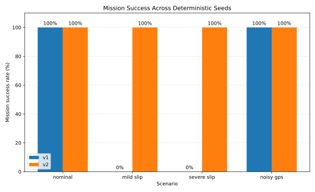
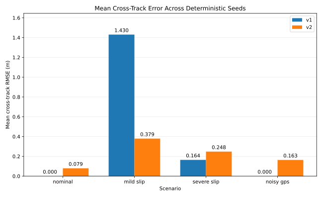

# Scenario Comparison

Results are means across five deterministic seeds.

| Scenario | Version | Runs | Success | Mean waypoints | Mean completion time (s) | Localization RMSE (m) | Cross-track RMSE (m) | Path efficiency |
|---|---:|---:|---:|---:|---:|---:|---:|---:|
| `nominal` | `v1` | 5 | 5/5 (100%) | 3.0 | 9.30 | 0.000 | 0.000 | 1.000 |
| `nominal` | `v2` | 5 | 5/5 (100%) | 3.0 | 9.46 | 0.067 | 0.079 | 0.989 |
| `mild_slip` | `v1` | 5 | 0/5 (0%) | 2.0 | — | 2.059 | 1.430 | — |
| `mild_slip` | `v2` | 5 | 5/5 (100%) | 3.0 | 11.88 | 0.131 | 0.379 | 0.897 |
| `severe_slip` | `v1` | 5 | 0/5 (0%) | 1.0 | — | 0.349 | 0.164 | — |
| `severe_slip` | `v2` | 5 | 5/5 (100%) | 3.0 | 16.70 | 0.155 | 0.248 | 0.767 |
| `noisy_gps` | `v1` | 5 | 5/5 (100%) | 3.0 | 9.30 | 0.000 | 0.000 | 1.000 |
| `noisy_gps` | `v2` | 5 | 5/5 (100%) | 3.0 | 10.50 | 0.137 | 0.163 | 0.951 |

## Plots

### Mission Success Rate

### Cross-Track Error

## Interpretation Notes

- Completion time and path efficiency are calculated only from successful runs.
- An em dash means the group contained no successful runs.
- Cross-track RMSE measures lateral path deviation, not motion smoothness or control jerk.
- A failed run can have lower cross-track error because it stops making meaningful route progress.
- These are descriptive results across five fixed seeds, not claims about statistical generalization.
